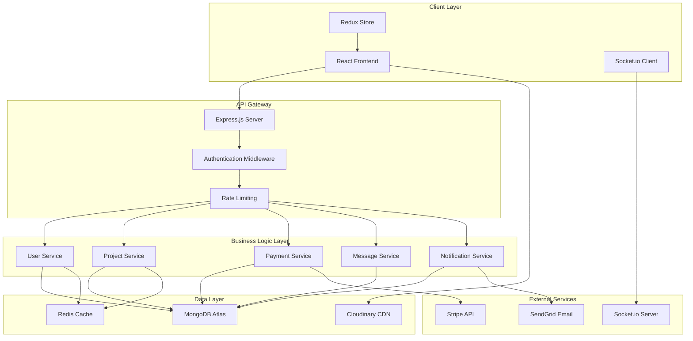
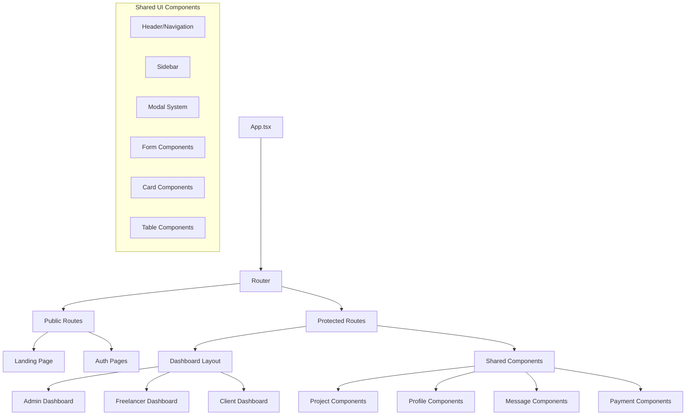

# TalentHive Platform Design Document

## Overview

TalentHive is a full-stack freelancing platform built using the MERN stack (MongoDB, Express.js, React.js, Node.js). The platform implements a microservices-inspired architecture with clear separation of concerns, real-time communication capabilities, and responsive design principles. The system supports three distinct user roles with role-based access control and provides comprehensive project management, payment processing, and communication features.

## Architecture

### High-Level Architecture



### Technology Stack

**Frontend:**
- React 18 with TypeScript
- Redux Toolkit for state management
- React Router v6 for navigation
- Material-UI (MUI) for component library
- Socket.io-client for real-time communication
- React Query for server state management
- Formik + Yup for form handling and validation

**Backend:**
- Node.js with Express.js framework
- TypeScript for type safety
- MongoDB with Mongoose ODM
- Socket.io for real-time features
- JWT for authentication
- Bcrypt for password hashing
- Multer for file uploads
- Express-rate-limit for API protection

**Infrastructure:**
- MongoDB Atlas for database hosting
- Redis for session storage and caching
- Cloudinary for image and file storage
- Stripe for payment processing
- SendGrid for email services
- PM2 for process management

## Components and Interfaces

### Frontend Component Architecture



### Backend API Structure

```
/api/v1/
├── /auth
│   ├── POST /register
│   ├── POST /login
│   ├── POST /logout
│   ├── POST /refresh-token
│   └── GET /verify-email/:token
├── /users
│   ├── GET /profile
│   ├── PUT /profile
│   ├── GET /freelancers
│   ├── GET /freelancers/:id
│   └── POST /upload-avatar
├── /projects
│   ├── GET /
│   ├── POST /
│   ├── GET /:id
│   ├── PUT /:id
│   ├── DELETE /:id
│   └── GET /search
├── /proposals
│   ├── GET /project/:projectId
│   ├── POST /
│   ├── PUT /:id
│   ├── DELETE /:id
│   └── POST /:id/accept
├── /contracts
│   ├── GET /
│   ├── POST /
│   ├── GET /:id
│   ├── PUT /:id/milestone
│   └── POST /:id/complete
├── /payments
│   ├── POST /create-payment-intent
│   ├── POST /confirm-payment
│   ├── GET /transactions
│   └── POST /withdraw
├── /messages
│   ├── GET /conversations
│   ├── GET /conversations/:id
│   ├── POST /conversations
│   └── POST /conversations/:id/messages
├── /reviews
│   ├── GET /user/:userId
│   ├── POST /
│   └── GET /:id
├── /notifications
│   ├── GET /
│   ├── PUT /:id/read
│   └── PUT /mark-all-read
└── /admin
    ├── GET /dashboard
    ├── GET /users
    ├── PUT /users/:id/status
    ├── GET /reports
    └── GET /disputes
```

## Data Models

### User Schema
```typescript
interface User {
  _id: ObjectId;
  email: string;
  password: string;
  role: 'admin' | 'freelancer' | 'client';
  profile: {
    firstName: string;
    lastName: string;
    avatar?: string;
    bio?: string;
    location?: string;
    timezone?: string;
  };
  freelancerProfile?: {
    title: string;
    hourlyRate: number;
    skills: string[];
    experience: string;
    portfolio: PortfolioItem[];
    availability: 'available' | 'busy' | 'unavailable';
  };
  clientProfile?: {
    companyName?: string;
    industry?: string;
    projectsPosted: number;
  };
  rating: {
    average: number;
    count: number;
  };
  isVerified: boolean;
  isActive: boolean;
  createdAt: Date;
  updatedAt: Date;
}
```

### Project Schema
```typescript
interface Project {
  _id: ObjectId;
  title: string;
  description: string;
  client: ObjectId; // User reference
  category: string;
  skills: string[];
  budget: {
    type: 'fixed' | 'hourly';
    min: number;
    max: number;
  };
  timeline: {
    duration: number;
    unit: 'days' | 'weeks' | 'months';
  };
  attachments: string[];
  status: 'open' | 'in_progress' | 'completed' | 'cancelled';
  visibility: 'public' | 'invite_only';
  proposals: ObjectId[]; // Proposal references
  selectedFreelancer?: ObjectId; // User reference
  createdAt: Date;
  updatedAt: Date;
}
```

### Proposal Schema
```typescript
interface Proposal {
  _id: ObjectId;
  project: ObjectId; // Project reference
  freelancer: ObjectId; // User reference
  coverLetter: string;
  bidAmount: number;
  timeline: {
    duration: number;
    unit: 'days' | 'weeks' | 'months';
  };
  attachments: string[];
  status: 'pending' | 'accepted' | 'rejected' | 'withdrawn';
  createdAt: Date;
  updatedAt: Date;
}
```

### Contract Schema
```typescript
interface Contract {
  _id: ObjectId;
  project: ObjectId; // Project reference
  client: ObjectId; // User reference
  freelancer: ObjectId; // User reference
  proposal: ObjectId; // Proposal reference
  totalAmount: number;
  milestones: Milestone[];
  status: 'active' | 'completed' | 'cancelled' | 'disputed';
  startDate: Date;
  endDate?: Date;
  createdAt: Date;
  updatedAt: Date;
}

interface Milestone {
  _id: ObjectId;
  title: string;
  description: string;
  amount: number;
  dueDate: Date;
  status: 'pending' | 'submitted' | 'approved' | 'rejected';
  deliverables: string[];
  submittedAt?: Date;
  approvedAt?: Date;
}
```

### Message Schema
```typescript
interface Conversation {
  _id: ObjectId;
  participants: ObjectId[]; // User references
  lastMessage?: ObjectId; // Message reference
  updatedAt: Date;
  createdAt: Date;
}

interface Message {
  _id: ObjectId;
  conversation: ObjectId; // Conversation reference
  sender: ObjectId; // User reference
  content: string;
  attachments: string[];
  readBy: {
    user: ObjectId;
    readAt: Date;
  }[];
  createdAt: Date;
}
```

### Review Schema
```typescript
interface Review {
  _id: ObjectId;
  contract: ObjectId; // Contract reference
  reviewer: ObjectId; // User reference
  reviewee: ObjectId; // User reference
  rating: number; // 1-5 stars
  comment: string;
  createdAt: Date;
}
```

## Error Handling

### Frontend Error Handling
- Global error boundary for React component errors
- Redux error state management for API failures
- Toast notifications for user-friendly error messages
- Form validation with real-time feedback
- Network error detection and retry mechanisms

### Backend Error Handling
```typescript
// Custom error classes
class AppError extends Error {
  statusCode: number;
  isOperational: boolean;
  
  constructor(message: string, statusCode: number) {
    super(message);
    this.statusCode = statusCode;
    this.isOperational = true;
  }
}

// Global error handler middleware
const globalErrorHandler = (err: any, req: Request, res: Response, next: NextFunction) => {
  err.statusCode = err.statusCode || 500;
  err.status = err.status || 'error';
  
  if (process.env.NODE_ENV === 'development') {
    sendErrorDev(err, res);
  } else {
    sendErrorProd(err, res);
  }
};
```

### Error Response Format
```typescript
interface ErrorResponse {
  status: 'error' | 'fail';
  message: string;
  errors?: ValidationError[];
  stack?: string; // Only in development
}
```

## Testing Strategy

### Frontend Testing
- **Unit Tests**: Jest + React Testing Library for component testing
- **Integration Tests**: Testing user workflows and component interactions
- **E2E Tests**: Cypress for critical user journeys
- **Visual Regression**: Chromatic for UI consistency

### Backend Testing
- **Unit Tests**: Jest for individual function testing
- **Integration Tests**: Supertest for API endpoint testing
- **Database Tests**: MongoDB Memory Server for isolated testing
- **Load Tests**: Artillery for performance testing

### Test Coverage Goals
- Minimum 80% code coverage for critical business logic
- 100% coverage for payment and security-related functions
- All API endpoints must have integration tests
- Critical user flows must have E2E test coverage

### Testing Environment Setup
```typescript
// Test database configuration
const testConfig = {
  mongodb: {
    uri: process.env.MONGODB_TEST_URI || 'mongodb://localhost:27017/talentHive_test',
    options: {
      useNewUrlParser: true,
      useUnifiedTopology: true,
    }
  },
  redis: {
    host: process.env.REDIS_TEST_HOST || 'localhost',
    port: process.env.REDIS_TEST_PORT || 6379,
    db: 1 // Separate database for tests
  }
};
```

## Security Considerations

### Authentication & Authorization
- JWT tokens with refresh token rotation
- Role-based access control (RBAC)
- Password strength requirements and hashing with bcrypt
- Email verification for account activation
- Rate limiting on authentication endpoints

### Data Protection
- Input validation and sanitization
- SQL injection prevention through Mongoose
- XSS protection with helmet.js
- CORS configuration for API security
- File upload validation and virus scanning

### Payment Security
- PCI DSS compliance through Stripe integration
- Escrow system for secure payments
- Transaction logging and audit trails
- Fraud detection and prevention measures

## Performance Optimization

### Frontend Optimization
- Code splitting with React.lazy()
- Image optimization with Cloudinary transformations
- Memoization with React.memo and useMemo
- Virtual scrolling for large lists
- Progressive Web App (PWA) features

### Backend Optimization
- Database indexing strategy
- Redis caching for frequently accessed data
- API response compression
- Connection pooling for database connections
- CDN integration for static assets

### Monitoring and Analytics
- Application performance monitoring with New Relic
- Error tracking with Sentry
- User analytics with Google Analytics
- Custom metrics dashboard for business KPIs
- Real-time system health monitoring