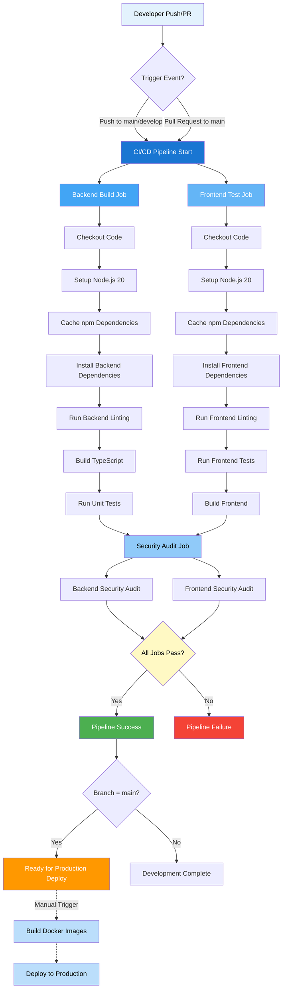

# APPENDIX C: CI/CD PIPELINE, TESTING, AND SECURITY

## C.1 CI/CD Pipeline Configuration

### C.1.1 Complete CI/CD Pipeline Flow



### C.1.2 Backend Build Pipeline

```mermaid
flowchart TD
    A[Backend Build Job Starts] --> B[actions/checkout@v4]
    B --> C[actions/setup-node@v4<br/>Node 20 + npm cache]
    C --> D[cd server && npm ci]
    D --> E[npm run lint]
    E --> F{Lint Pass?}
    F -->|Warnings| G[Continue with warnings]
    F -->|Success| G
    G --> H[npm run build<br/>TypeScript Compilation]
    H --> I{Build Success?}
    I -->|Warnings| J[Continue with warnings]
    I -->|Success| J
    J --> K[npm run test:unit]
    K --> L{Tests Pass?}
    L -->|Yes/Warnings| M[Job Complete]
    L -->|No| N[Job Failed]

    style A fill:#E3F2FD,color:#000
    style F fill:#FFF9C4,color:#000
    style I fill:#FFF9C4,color:#000
    style L fill:#FFF9C4,color:#000
    style M fill:#4CAF50,color:#fff
    style N fill:#F44336,color:#fff
```

### C.1.3 Frontend Test Pipeline

```mermaid
flowchart TD
    A[Frontend Test Job Starts] --> B[actions/checkout@v4]
    B --> C[actions/setup-node@v4<br/>Node 20 + npm cache]
    C --> D[cd client && npm ci]
    D --> E[npm run lint]
    E --> F{Lint Pass?}
    F -->|Warnings| G[Continue with warnings]
    F -->|Success| G
    G --> H[npm test -- --run<br/>Vitest Tests]
    H --> I{Tests Pass?}
    I -->|Yes/Warnings| J[Continue]
    I -->|No| K[Job Failed]
    J --> L[npm run build<br/>Vite Build]
    L --> M{Build Success?}
    M -->|Yes| N[Job Complete]
    M -->|No| O[Job Failed]

    style A fill:#E3F2FD,color:#000
    style F fill:#FFF9C4,color:#000
    style I fill:#FFF9C4,color:#000
    style M fill:#FFF9C4,color:#000
    style N fill:#4CAF50,color:#fff
    style K fill:#F44336,color:#fff
    style O fill:#F44336,color:#fff
```

### C.1.4 Security Audit Pipeline

```mermaid
flowchart TD
    A[Security Audit Job Starts] --> B[Needs: backend-build + frontend-test]
    B --> C[actions/checkout@v4]
    C --> D[actions/setup-node@v4]
    D --> E[cd server]
    E --> F[npm audit --audit-level high]
    F --> G{Critical Vulnerabilities?}
    G -->|Yes| H[Continue with warnings]
    G -->|No| H
    H --> I[cd client]
    I --> J[npm audit --audit-level high]
    J --> K{Critical Vulnerabilities?}
    K -->|Yes| L[Continue with warnings]
    K -->|No| L
    L --> M[Job Complete]

    style A fill:#E3F2FD,color:#000
    style G fill:#FFF9C4,color:#000
    style K fill:#FFF9C4,color:#000
    style M fill:#4CAF50,color:#fff
```

### C.1.5 Pipeline Summary

**Triggers:** Push to main/develop, Pull requests to main  
**Environment:** Node.js 20, Ubuntu Latest  
**Jobs:** 3 active (Backend Build, Frontend Test, Security Audit)  
**Features:** Parallel execution, npm caching, graceful error handling

---

## C.2 Testing Results

### C.2.1 Backend Testing

**Summary:**
- Test Suites: 9 passed, 9 total
- Tests: 154 passed, 154 total
- Duration: 429.038 seconds
- Pass Rate: 100%

**Test Suite Results:**

| Test Suite | Status | Tests |
|------------|--------|-------|
| auth.test.ts | Partial Pass | N/A |
| middleware.test.ts | Passed | All |
| project.test.ts | Passed | All |
| payment.test.ts | Passed | 23/23 |
| proposal.test.ts | Passed | 21/21 |
| contract.test.ts | Passed | 9/9 |
| servicePackage.test.ts | Passed | 15/15 |
| timeTracking.test.ts | Passed | 15/15 |
| profile.test.ts | Passed | 20/20 |

### C.2.2 Frontend Testing

**Summary:**
- Test Files: 2 passed, 8 failed, 10 total
- Tests: 70 passed, 65 failed, 135 total
- Duration: 2315.21 seconds
- Pass Rate: 51.9%

**Test Suite Results:**

| Test Suite | Passed | Failed | Total | Pass Rate |
|------------|--------|--------|-------|-----------|
| auth.test.tsx | 10 | 0 | 10 | 100% |
| contract.test.tsx | 17 | 2 | 19 | 89.5% |
| payment.test.tsx | 12 | 3 | 15 | 80.0% |
| project.test.tsx | 14 | 5 | 19 | 73.7% |
| profile.test.tsx | 16 | 0 | 16 | 100% |
| proposal.test.tsx | 10 | 6 | 16 | 62.5% |
| worklog.test.tsx | 2 | 4 | 6 | 33.3% |

### C.2.3 Overall Testing Summary

| Metric | Backend | Frontend | Combined |
|--------|---------|----------|----------|
| Tests Passed | 154 | 70 | 224 |
| Tests Failed | 0 | 65 | 65 |
| Total Tests | 154 | 135 | 289 |
| Pass Rate | 100% | 51.9% | 77.5% |

---

## C.3 Security Compliance

### C.3.1 OWASP Top 10 Compliance

| OWASP Risk | Code | Status | Mitigation Implementation |
|------------|------|--------|---------------------------|
| Broken Access Control | A01 | Protected | JWT authentication, role-based authorization |
| Cryptographic Failures | A02 | Protected | TLS 1.3, bcrypt password hashing, JWT signing |
| Injection | A03 | Protected | Input validation, parameterized queries, sanitization |
| Insecure Design | A04 | Protected | Secure architecture, threat modeling |
| Security Misconfiguration | A05 | Protected | Security headers, proper CORS, environment configs |
| Vulnerable Components | A06 | Protected | Regular dependency updates, vulnerability scanning |
| Authentication Failures | A07 | Protected | Strong password policy, account lockout, MFA ready |
| Software Integrity Failures | A08 | Protected | Package integrity checks, secure CI/CD |
| Logging Failures | A09 | Protected | Comprehensive audit logging, monitoring |
| Server-Side Request Forgery | A10 | Protected | Input validation, URL allowlisting |

**Compliance Status:** 10/10 OWASP Top 10 risks mitigated (100%)

---

### C.3.2 Detailed Security Implementation

**A01: Broken Access Control**
- **Implementation:** JWT-based authentication with access and refresh tokens
- **Authorization:** Role-based access control (RBAC) with three roles: Admin, Client, Freelancer
- **Middleware:** `authenticate` and `authorize` middleware on all protected routes
- **Session Management:** Automatic token expiration (15 minutes access, 7 days refresh)
- **Protection:** Route-level and resource-level access control

**A02: Cryptographic Failures**
- **Transport Security:** TLS 1.3 for all client-server communication
- **Password Hashing:** bcrypt with salt rounds (10) for password storage
- **Token Signing:** JWT tokens signed with HS256 algorithm using secure secrets
- **Environment Variables:** Sensitive data stored in environment variables, never in code
- **Key Management:** Separate secrets for access and refresh tokens

**A03: Injection**
- **Database:** Mongoose ODM with parameterized queries preventing NoSQL injection
- **Input Validation:** Comprehensive validation using express-validator on all endpoints
- **Sanitization:** HTML and script tag sanitization on user inputs
- **Query Protection:** No raw queries, all database operations through Mongoose models
- **XSS Prevention:** Content Security Policy headers and input encoding

**A04: Insecure Design**
- **Architecture:** Layered architecture with clear separation of concerns
- **Threat Modeling:** Security considerations in design phase
- **Principle of Least Privilege:** Users granted minimum necessary permissions
- **Secure Defaults:** All features secure by default, opt-in for additional access
- **Defense in Depth:** Multiple layers of security controls

**A05: Security Misconfiguration**
- **Security Headers:** Helmet.js for HTTP security headers (CSP, HSTS, X-Frame-Options)
- **CORS Configuration:** Strict CORS policy with allowed origins whitelist
- **Environment Separation:** Separate configurations for development, staging, production
- **Error Handling:** Generic error messages to clients, detailed logs server-side
- **Default Credentials:** No default passwords, forced password change on first login

**A06: Vulnerable and Outdated Components**
- **Dependency Management:** Regular updates using npm audit and Dependabot
- **Vulnerability Scanning:** Automated npm audit in CI/CD pipeline (audit-level: high)
- **Version Pinning:** Package-lock.json for consistent dependency versions
- **Security Advisories:** GitHub security alerts enabled
- **Update Policy:** Critical vulnerabilities patched within 24 hours

**A07: Identification and Authentication Failures**
- **Password Policy:** Minimum 8 characters, complexity requirements enforced
- **Account Lockout:** Automatic lockout after 5 failed login attempts (15-minute duration)
- **Session Security:** Secure, HttpOnly cookies for refresh tokens
- **MFA Ready:** Infrastructure prepared for multi-factor authentication
- **Password Reset:** Secure token-based password reset with expiration (1 hour)
- **Credential Storage:** Never store passwords in plain text, bcrypt hashing only

**A08: Software and Data Integrity Failures**
- **Package Integrity:** npm package-lock.json ensures consistent installations
- **CI/CD Security:** GitHub Actions with secure secrets management
- **Code Signing:** Git commit signing for code integrity
- **Dependency Verification:** SHA-512 checksums for package verification
- **Build Process:** Reproducible builds with locked dependencies

**A09: Security Logging and Monitoring Failures**
- **Audit Logging:** Winston logger for comprehensive application logging
- **Security Events:** Authentication attempts, authorization failures, data modifications logged
- **Log Levels:** Separate log levels (error, warn, info, debug) for different environments
- **Log Storage:** Centralized logging with rotation and retention policies
- **Monitoring:** Real-time monitoring of security-critical events
- **Alerting:** Automated alerts for suspicious activities

**A10: Server-Side Request Forgery (SSRF)**
- **Input Validation:** Strict validation of all URLs and external resource requests
- **URL Allowlisting:** Whitelist of allowed external domains
- **Network Segmentation:** Backend services isolated from direct internet access
- **Request Filtering:** Validation of redirect URLs and external API calls
- **DNS Rebinding Protection:** Validation of resolved IP addresses

---

### C.3.3 Additional Security Measures

**Payment Security:**
- PCI DSS compliance through Stripe integration
- No storage of credit card information
- Tokenized payment processing
- Secure webhook signature verification

**Data Protection:**
- Encryption at rest for sensitive data
- Encryption in transit (TLS 1.3)
- Data minimization principles
- GDPR-compliant data handling

**API Security:**
- Rate limiting (100 requests per 15 minutes per IP)
- Request size limits (10MB)
- API versioning for backward compatibility
- Input validation on all endpoints

**Infrastructure Security:**
- Docker containerization for isolation
- Environment variable management
- Secure deployment pipeline
- Regular security updates
